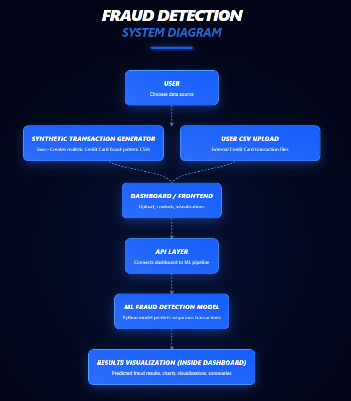

# SeniorProject  
End-to-End Data Analytics Fraud Detection Platform  

Group Members: John Cavanaugh, Matt Todaro, Derek Mendez  

Here is a cleaner, more polished version you can paste directly:

---

## Full Project Setup Guide

### First Clone the Repository

```bash
git clone https://github.com/todarom3/SeniorProject.git
cd SeniorProject
```

## Fake Transaction Generator Setup and Run

The fake transaction generator is located in:
`FakeTransactionGenerator/src/`

### Compile

From inside the `src` folder:

```bash
javac CCTransactionGenerator2.java
```

### Run

```bash
java CCTransactionGenerator2
```

---

## Output Files

* `transactions3.csv` → 10,000 total generated transactions
* `fraud_log.csv` → fraudulent transactions with explanations

These files are used for fraud detection training and analysis.

---

## How Transactions Were Generated

Transactions are synthetically generated using a Java program that simulates realistic credit card behavior:

* Generates 10,000 total transactions from 1,000 fake credit cards
* Each card has realistic spending patterns and merchant interactions
* Most transactions are normal, based on merchant, location, device, and spending behavior
* Fraud is injected using realistic patterns such as location jumps, test charges, rapid purchases, and over-limit spending
* Maintains an approximate 9% fraud rate

This creates a balanced dataset that mimics real-world financial transaction behavior for machine learning training.

For full details on generation logic and fraud patterns, see:
[FakeTransactionInfo.txt](Transactions/FakeTransactionInfo.txt)

---

## Dataset Split

* Training set: 80%
* Validation set: 10%
* Test set: 10% (used to evaluate final model performance on unseen data)


## Toy Model Setup & Run

From the project root:

- Create environment: `/usr/bin/python3 -m venv .venv`
- Install dependencies: `./.venv/bin/python -m pip install --upgrade pip && ./.venv/bin/python -m pip install -r requirements.txt`

Run scripts:

- Train and evaluate model (prints 80/10/10 split metrics and saves model): `./.venv/bin/python toyModel/model.py`
- Inference sanity check (loads saved model and prints sample predictions): `./.venv/bin/python tests/testModel.py`

## Dashboard Usage (Deployed on Vercel)

The dashboard is fully deployed using Vercel, so no local setup is required to use it.

### How to Use

1. Open the deployed dashboard in your browser: https://senior-project-beryl.vercel.app/  
2. Click **"Choose File"** and upload a CSV file (such as `transactions3.csv` generated from the Fake Transaction Generator)  
3. Click **"Upload and Analyze"**  
4. Wait for the loading screen to complete  
5. View the results in the dashboard  

---

### What the Dashboard Shows

- **Transaction Table**
  - Displays all transactions from the uploaded file
  - Transaction ID represents the order the transactions were generated
  - Credit card numbers are masked (only last 4 digits shown)

- **Fraud Predictions**
  - Each transaction is labeled as fraud or non-fraud
  - Fraud probability is displayed (capped below 100% for realism)

- **Fraud Reasoning**
  - Shows the top factors that contributed to the fraud prediction
  - Helps explain why the model flagged a transaction

- **Charts and Metrics**
  - Fraud vs Non-Fraud distribution
  - Fraud by location
  - Transactions by device
  - Summary metrics (total transactions, fraud count, fraud rate, etc.)

---

### How It Works

1. The uploaded CSV file is sent to the backend API  
2. The backend processes the data and feeds it into the trained machine learning model  
3. The model returns:
   - A fraud prediction (yes/no)
   - A probability score
   - Top contributing features (reasoning)
4. The frontend dashboard displays the results in tables and charts  

---

### Notes

- The system uses **synthetic transaction data** (not real financial data)  
- Transaction IDs reflect generation order, not timestamps  
- The dashboard is designed to demonstrate a full data pipeline from input → model → visualization  

## System Diagram  


